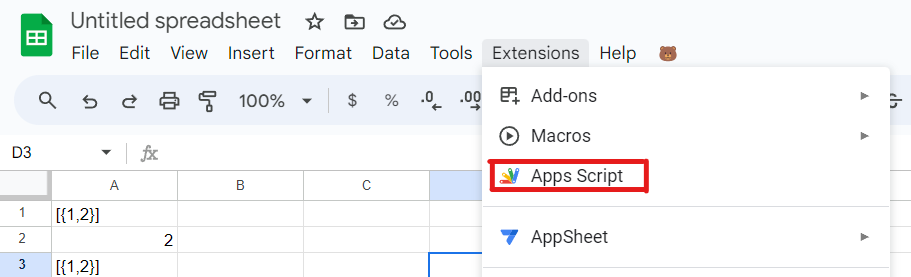
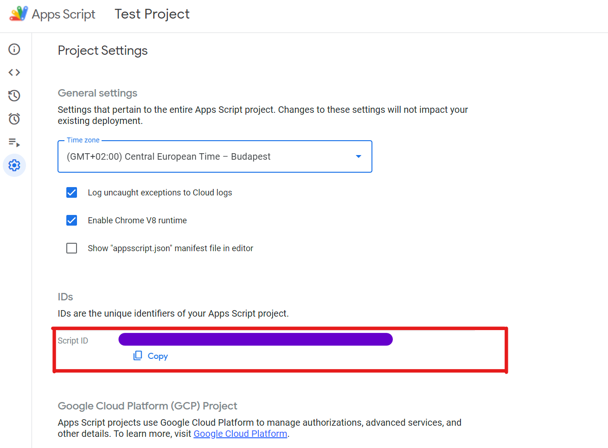

# Sheets Game Exporter
This README file outlines the steps for setting up the project, from installing Node.js and clasp, to logging in to clasp, finding the Extensions tab in Google Sheets, copying the Script ID, and initializing and pushing the project with the appropriate npm commands. Images are included to illustrate where to find the Extensions tab and the Script ID in Google Sheets.

## Project Setup Guide
Follow these steps to set up the solution stored in this GitHub repository:
### Step 1: Clone the repository'
Clone the repository using the following command:
```bash
git clone https://github.com/public-bear-necessities/sheets-game-exporter.git
```

### Step 2: Install Node.js
Download and install Node.js from [the official website](https://nodejs.org/).

### Step 3: Install Clasp
Install `clasp` globally using npm with the following command:
```bash
npm install -g @google/clasp
```

### Step 4: Log in to Clasp
Log in to Clasp using the following command:
```bash
clasp login
```

### Step 5: Find the script ID
Open the Google Sheet you want to instal this extension to and copy the script ID.
Open the Extneions menu and select "Apps Script". This will open the Apps Script editor.



### Step 6: Initialize the project
Navigate to the directory where you cloned the repository.

Run the following command to initialize your project, replacing '[YOUR-SCRIPT-ID]' with the Script ID copied in the previous step:
```bash
npm run init [YOUR-SCRIPT-ID]
```

### Step 7: Push the project
Run the following command to push the project to your Google Sheet:
```bash
npm run push
```
Now your project is set up and pushed to clasp. You can start working on your Google Apps Script project!